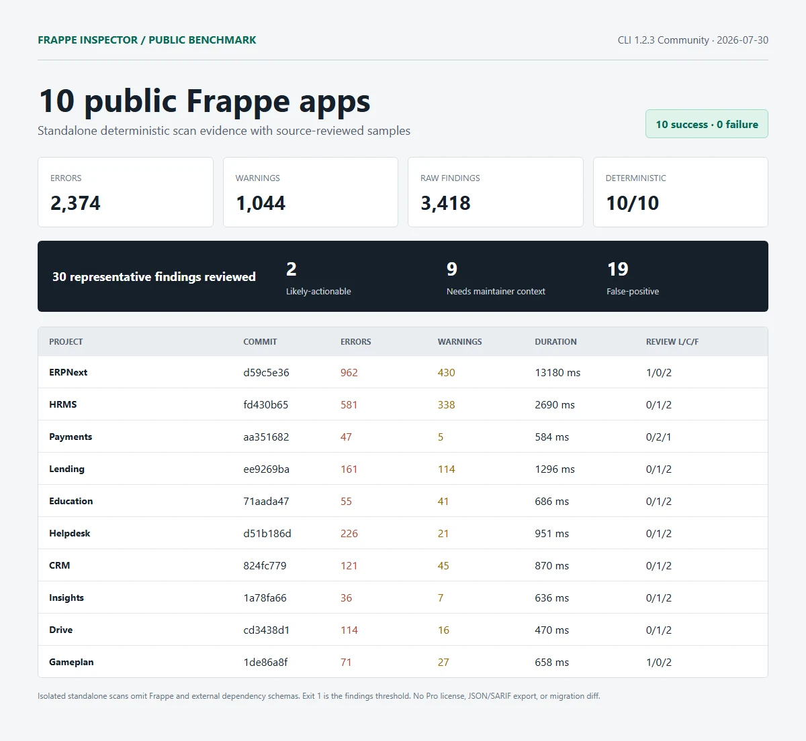

# Public benchmark v1

This dataset records isolated, standalone scans of ten public Frappe applications with `@frappe-inspector/cli` **1.2.3 Community** on 2026-07-30. All ten scans completed and produced reports. Exit code `1` is the configured findings-threshold result, not a scan failure.

## Results

| Project | Commit | Errors | Warnings | Run 1 | Reviewed L / C / F | Deterministic |
| --- | --- | ---: | ---: | ---: | ---: | :---: |
| [ERPNext](projects/erpnext.md) | [`d59c5e36`](https://github.com/frappe/erpnext/commit/d59c5e36bcb53be84ec46bd5d29b5c0b2f46f929) | 962 | 430 | 13,180 ms | 1 / 0 / 2 | Yes |
| [HRMS](projects/hrms.md) | [`fd430b65`](https://github.com/frappe/hrms/commit/fd430b654630becd4ae5298089450c9b2abd3753) | 581 | 338 | 2,690 ms | 0 / 1 / 2 | Yes |
| [Payments](projects/payments.md) | [`aa351682`](https://github.com/frappe/payments/commit/aa3516827fe51d5557975b74e574e3bca9a3070d) | 47 | 5 | 584 ms | 0 / 2 / 1 | Yes |
| [Lending](projects/lending.md) | [`ee9269ba`](https://github.com/frappe/lending/commit/ee9269ba08b72fd22295a993986d6502ce1bc399) | 161 | 114 | 1,296 ms | 0 / 1 / 2 | Yes |
| [Education](projects/education.md) | [`71aada47`](https://github.com/frappe/education/commit/71aada478bf682f6d034fd4caa6f2f5438b5ace9) | 55 | 41 | 686 ms | 0 / 1 / 2 | Yes |
| [Helpdesk](projects/helpdesk.md) | [`d51b186d`](https://github.com/frappe/helpdesk/commit/d51b186dc51b49fa7ac93a40df7e736e1a97708d) | 226 | 21 | 951 ms | 0 / 1 / 2 | Yes |
| [CRM](projects/crm.md) | [`824fc779`](https://github.com/frappe/crm/commit/824fc779b8db3945a6fbd6ea95b08701d6195d60) | 121 | 45 | 870 ms | 0 / 1 / 2 | Yes |
| [Insights](projects/insights.md) | [`1a78fa66`](https://github.com/frappe/insights/commit/1a78fa6631d158f115c507d1224cc50a3d0de36a) | 36 | 7 | 636 ms | 0 / 1 / 2 | Yes |
| [Drive](projects/drive.md) | [`cd3438d1`](https://github.com/frappe/drive/commit/cd3438d1ab0b0fc1b8c10e282639ec0bd2ee7d82) | 114 | 16 | 470 ms | 0 / 1 / 2 | Yes |
| [Gameplan](projects/gameplan.md) | [`1de86a8f`](https://github.com/frappe/gameplan/commit/1de86a8fce4a16e25ef1797fd890c1fbcc7ea89e) | 71 | 27 | 658 ms | 1 / 0 / 2 | Yes |

Aggregate: **10 success / 0 failure**, **2,374 errors**, **1,044 warnings**, **3,418 raw findings**, and **10/10 deterministic** two-run report checks. Manual review covers exactly **30 representative findings**: **2 likely-actionable**, **9 needs-maintainer-context**, and **19 false-positive**.

## Read the evidence

- [Methodology and limitations](methodology.md)
- [Machine-readable JSON](results.json) and [documented schema](schema.json)
- [CSV summary](results.csv)
- [Manual VS Code Community screenshot checklist](manual-vscode-screenshot-checklist.md)
- [Automated VS Code Community Extension Host results](vscode-community-results.md)
- Full sanitized reports, exact raw metadata, and SHA-256 files under [reports/](reports/)

The Lending `FI031` report for `generate_loan_repayment_schedule` is the detailed false-positive case study: the reported module exists in the scanned source. The two likely-actionable samples are the ERPNext `POS Profile.utm_medium` Link target inconsistency and the Gameplan legacy `team_user_profile` patch package path.

## Disclaimer

Frappe Inspector is an independent third-party project. This benchmark is not affiliated with or endorsed by Frappe Technologies or the maintainers of the scanned projects. It is a static-analysis product benchmark, not a security assessment or security disclosure. The classifications describe sampled tool findings and must not be read as claims about project quality or maintainers.
