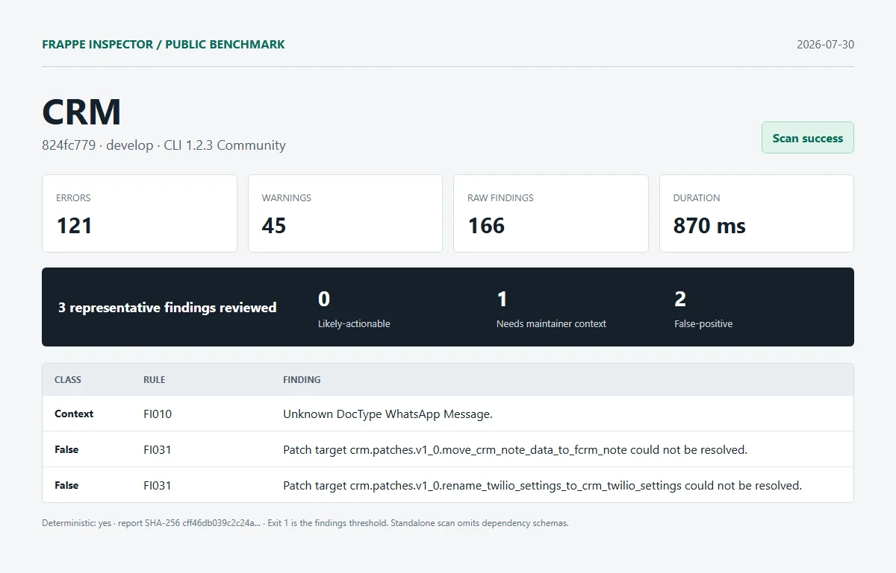

# CRM

| Field | Value |
| --- | --- |
| Repository | [https://github.com/frappe/crm.git](https://github.com/frappe/crm) |
| Branch | `develop` |
| Commit | [`824fc779b8db3945a6fbd6ea95b08701d6195d60`](https://github.com/frappe/crm/commit/824fc779b8db3945a6fbd6ea95b08701d6195d60) |
| Commit date | `2026-07-31T02:09:52+05:30` |
| Benchmark date | `2026-07-30` |
| CLI | `@frappe-inspector/cli` 1.2.3 Community |
| Status | Success; report generated, exit `1` indicates findings threshold |
| Run 1 | 121 errors, 45 warnings, 166 raw findings in 870 ms |
| Deterministic | Yes; run 1 and run 2 report SHA-256 matched |

## Manual review

1. **needs-maintainer-context - FI010**: Unknown DocType WhatsApp Message.
   - Location: `crm/api/whatsapp.py:129`
   - Source verification: The reference is inside the WhatsApp integration. The isolated checkout does not include the optional integration schema, and crm/hooks.py does not make that deployment context explicit.
2. **false-positive - FI031**: Patch target crm.patches.v1_0.move_crm_note_data_to_fcrm_note could not be resolved.
   - Location: `crm/patches.txt:4`
   - Source verification: The module exists at crm/patches/v1_0/move_crm_note_data_to_fcrm_note.py.
3. **false-positive - FI031**: Patch target crm.patches.v1_0.rename_twilio_settings_to_crm_twilio_settings could not be resolved.
   - Location: `crm/patches.txt:5`
   - Source verification: The module exists at crm/patches/v1_0/rename_twilio_settings_to_crm_twilio_settings.py.

Reviewed split: **0 likely-actionable**, **1 needs-maintainer-context**, **2 false-positive**.

## Artifacts

- [Full sanitized Markdown report](../reports/crm/report.md)
- [SHA-256](../reports/crm/report.sha256)
- [Exact raw scan metadata](../reports/crm/metadata.json)
- [Methodology and limitations](../methodology.md)

This was an isolated standalone scan. Frappe and external dependency schemas were omitted. No Pro license, JSON/SARIF export, or migration diff was used. Findings are static-analysis output, not security claims.
