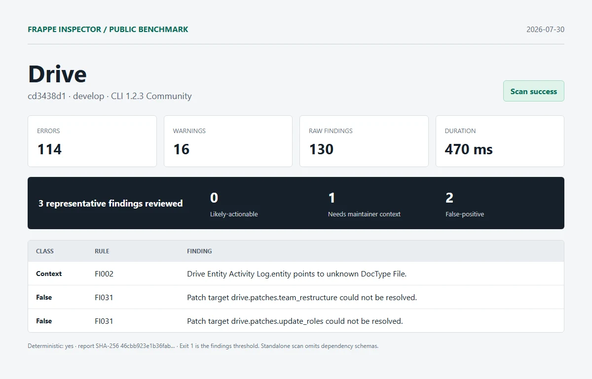

# Drive

| Field | Value |
| --- | --- |
| Repository | [https://github.com/frappe/drive.git](https://github.com/frappe/drive) |
| Branch | `develop` |
| Commit | [`cd3438d1ab0b0fc1b8c10e282639ec0bd2ee7d82`](https://github.com/frappe/drive/commit/cd3438d1ab0b0fc1b8c10e282639ec0bd2ee7d82) |
| Commit date | `2026-06-25T08:03:10+05:30` |
| Benchmark date | `2026-07-30` |
| CLI | `@frappe-inspector/cli` 1.2.3 Community |
| Status | Success; report generated, exit `1` indicates findings threshold |
| Run 1 | 114 errors, 16 warnings, 130 raw findings in 470 ms |
| Deterministic | Yes; run 1 and run 2 report SHA-256 matched |

## Manual review

1. **needs-maintainer-context - FI002**: Drive Entity Activity Log.entity points to unknown DocType File.
   - Location: `drive/drive/doctype/drive_entity_activity_log/drive_entity_activity_log.json:44`
   - Source verification: File is a Frappe core DocType. The isolated app scan omitted the Frappe schema used by Drive at runtime.
2. **false-positive - FI031**: Patch target drive.patches.team_restructure could not be resolved.
   - Location: `drive/patches.txt:2`
   - Source verification: The module exists at drive/patches/team_restructure.py.
3. **false-positive - FI031**: Patch target drive.patches.update_roles could not be resolved.
   - Location: `drive/patches.txt:3`
   - Source verification: The module exists at drive/patches/update_roles.py.

Reviewed split: **0 likely-actionable**, **1 needs-maintainer-context**, **2 false-positive**.

## Artifacts

- [Full sanitized Markdown report](../reports/drive/report.md)
- [SHA-256](../reports/drive/report.sha256)
- [Exact raw scan metadata](../reports/drive/metadata.json)
- [Methodology and limitations](../methodology.md)

This was an isolated standalone scan. Frappe and external dependency schemas were omitted. No Pro license, JSON/SARIF export, or migration diff was used. Findings are static-analysis output, not security claims.
