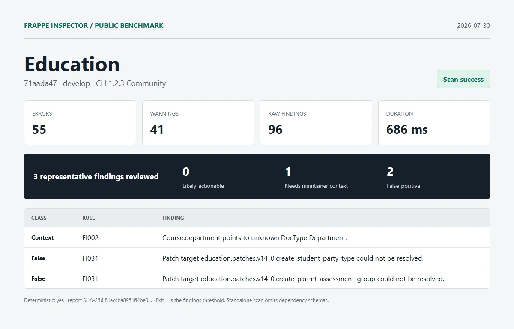

# Education

| Field | Value |
| --- | --- |
| Repository | [https://github.com/frappe/education.git](https://github.com/frappe/education) |
| Branch | `develop` |
| Commit | [`71aada478bf682f6d034fd4caa6f2f5438b5ace9`](https://github.com/frappe/education/commit/71aada478bf682f6d034fd4caa6f2f5438b5ace9) |
| Commit date | `2026-06-05T15:45:42+03:00` |
| Benchmark date | `2026-07-30` |
| CLI | `@frappe-inspector/cli` 1.2.3 Community |
| Status | Success; report generated, exit `1` indicates findings threshold |
| Run 1 | 55 errors, 41 warnings, 96 raw findings in 686 ms |
| Deterministic | Yes; run 1 and run 2 report SHA-256 matched |

## Manual review

1. **needs-maintainer-context - FI002**: Course.department points to unknown DocType Department.
   - Location: `education/education/doctype/course/course.json:33`
   - Source verification: education/hooks.py declares required_apps = ["erpnext"]. Department is supplied by the omitted dependency schema.
2. **false-positive - FI031**: Patch target education.patches.v14_0.create_student_party_type could not be resolved.
   - Location: `education/patches.txt:2`
   - Source verification: The module exists at education/patches/v14_0/create_student_party_type.py.
3. **false-positive - FI031**: Patch target education.patches.v14_0.create_parent_assessment_group could not be resolved.
   - Location: `education/patches.txt:5`
   - Source verification: The module exists at education/patches/v14_0/create_parent_assessment_group.py.

Reviewed split: **0 likely-actionable**, **1 needs-maintainer-context**, **2 false-positive**.

## Artifacts

- [Full sanitized Markdown report](../reports/education/report.md)
- [SHA-256](../reports/education/report.sha256)
- [Exact raw scan metadata](../reports/education/metadata.json)
- [Methodology and limitations](../methodology.md)

This was an isolated standalone scan. Frappe and external dependency schemas were omitted. No Pro license, JSON/SARIF export, or migration diff was used. Findings are static-analysis output, not security claims.
