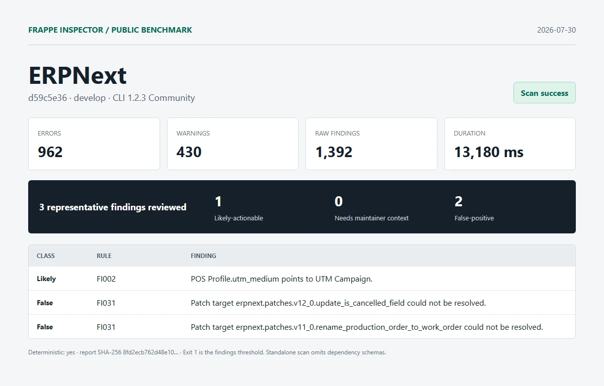

# ERPNext

| Field | Value |
| --- | --- |
| Repository | [https://github.com/frappe/erpnext.git](https://github.com/frappe/erpnext) |
| Branch | `develop` |
| Commit | [`d59c5e36bcb53be84ec46bd5d29b5c0b2f46f929`](https://github.com/frappe/erpnext/commit/d59c5e36bcb53be84ec46bd5d29b5c0b2f46f929) |
| Commit date | `2026-07-30T23:24:59+05:30` |
| Benchmark date | `2026-07-30` |
| CLI | `@frappe-inspector/cli` 1.2.3 Community |
| Status | Success; report generated, exit `1` indicates findings threshold |
| Run 1 | 962 errors, 430 warnings, 1,392 raw findings in 13,180 ms |
| Deterministic | Yes; run 1 and run 2 report SHA-256 matched |

## Manual review

1. **likely-actionable - FI002**: POS Profile.utm_medium points to UTM Campaign.
   - Location: `erpnext/accounts/doctype/pos_profile/pos_profile.json:417`
   - Source verification: The neighboring utm_campaign and utm_source fields target UTM Campaign and UTM Source, while other ERPNext utm_medium fields target UTM Medium. The source at lines 417-420 instead targets UTM Campaign.
2. **false-positive - FI031**: Patch target erpnext.patches.v12_0.update_is_cancelled_field could not be resolved.
   - Location: `erpnext/patches.txt:2`
   - Source verification: The target module exists at erpnext/patches/v12_0/update_is_cancelled_field.py in the scanned commit.
3. **false-positive - FI031**: Patch target erpnext.patches.v11_0.rename_production_order_to_work_order could not be resolved.
   - Location: `erpnext/patches.txt:3`
   - Source verification: The target module exists at erpnext/patches/v11_0/rename_production_order_to_work_order.py in the scanned commit.

Reviewed split: **1 likely-actionable**, **0 needs-maintainer-context**, **2 false-positive**.

## Artifacts

- [Full sanitized Markdown report](../reports/erpnext/report.md)
- [SHA-256](../reports/erpnext/report.sha256)
- [Exact raw scan metadata](../reports/erpnext/metadata.json)
- [Methodology and limitations](../methodology.md)

This was an isolated standalone scan. Frappe and external dependency schemas were omitted. No Pro license, JSON/SARIF export, or migration diff was used. Findings are static-analysis output, not security claims.
