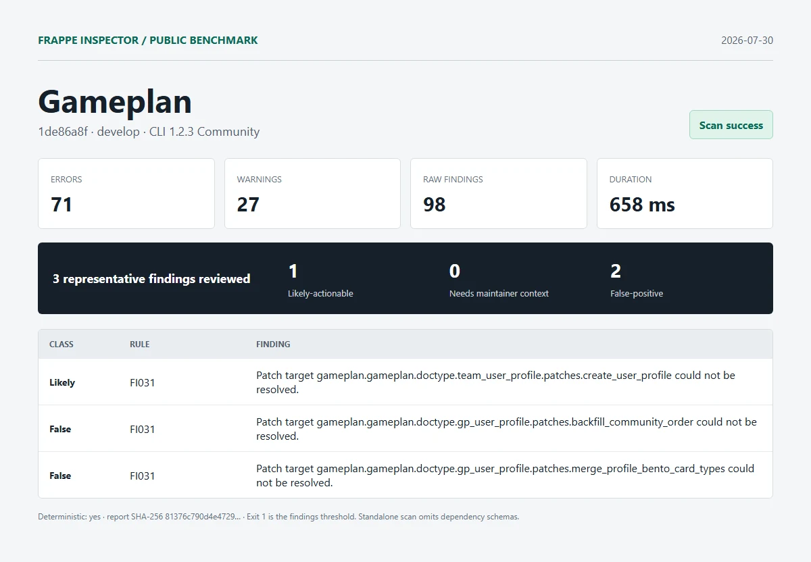

# Gameplan

| Field | Value |
| --- | --- |
| Repository | [https://github.com/frappe/gameplan.git](https://github.com/frappe/gameplan) |
| Branch | `develop` |
| Commit | [`1de86a8fce4a16e25ef1797fd890c1fbcc7ea89e`](https://github.com/frappe/gameplan/commit/1de86a8fce4a16e25ef1797fd890c1fbcc7ea89e) |
| Commit date | `2026-07-30T23:28:11+05:30` |
| Benchmark date | `2026-07-30` |
| CLI | `@frappe-inspector/cli` 1.2.3 Community |
| Status | Success; report generated, exit `1` indicates findings threshold |
| Run 1 | 71 errors, 27 warnings, 98 raw findings in 658 ms |
| Deterministic | Yes; run 1 and run 2 report SHA-256 matched |

## Manual review

1. **likely-actionable - FI031**: Patch target gameplan.gameplan.doctype.team_user_profile.patches.create_user_profile could not be resolved.
   - Location: `gameplan/patches.txt:6`
   - Source verification: The checkout contains gp_user_profile, not team_user_profile. Later patch entries already use gameplan.gameplan.doctype.gp_user_profile, so the old package path is inconsistent with the current source tree.
2. **false-positive - FI031**: Patch target gameplan.gameplan.doctype.gp_user_profile.patches.backfill_community_order could not be resolved.
   - Location: `gameplan/patches.txt:39`
   - Source verification: The module exists at gameplan/doctype/gp_user_profile/patches/backfill_community_order.py.
3. **false-positive - FI031**: Patch target gameplan.gameplan.doctype.gp_user_profile.patches.merge_profile_bento_card_types could not be resolved.
   - Location: `gameplan/patches.txt:43`
   - Source verification: The module exists at gameplan/doctype/gp_user_profile/patches/merge_profile_bento_card_types.py.

Reviewed split: **1 likely-actionable**, **0 needs-maintainer-context**, **2 false-positive**.

## Artifacts

- [Full sanitized Markdown report](../reports/gameplan/report.md)
- [SHA-256](../reports/gameplan/report.sha256)
- [Exact raw scan metadata](../reports/gameplan/metadata.json)
- [Methodology and limitations](../methodology.md)

This was an isolated standalone scan. Frappe and external dependency schemas were omitted. No Pro license, JSON/SARIF export, or migration diff was used. Findings are static-analysis output, not security claims.
