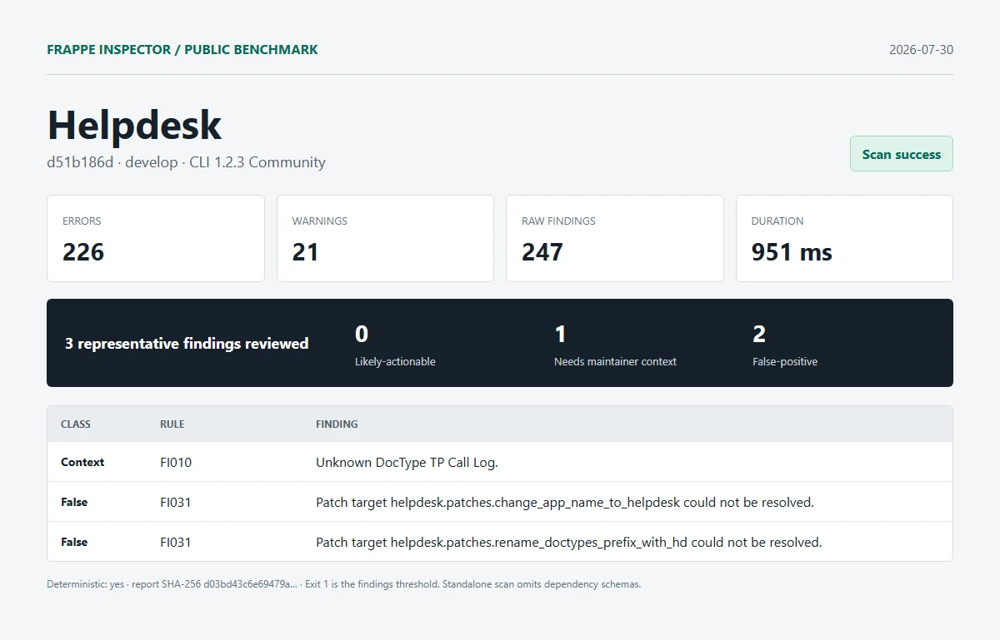

# Helpdesk

| Field | Value |
| --- | --- |
| Repository | [https://github.com/frappe/helpdesk.git](https://github.com/frappe/helpdesk) |
| Branch | `develop` |
| Commit | [`d51b186dc51b49fa7ac93a40df7e736e1a97708d`](https://github.com/frappe/helpdesk/commit/d51b186dc51b49fa7ac93a40df7e736e1a97708d) |
| Commit date | `2026-07-31T03:53:33+05:30` |
| Benchmark date | `2026-07-30` |
| CLI | `@frappe-inspector/cli` 1.2.3 Community |
| Status | Success; report generated, exit `1` indicates findings threshold |
| Run 1 | 226 errors, 21 warnings, 247 raw findings in 951 ms |
| Deterministic | Yes; run 1 and run 2 report SHA-256 matched |

## Manual review

1. **needs-maintainer-context - FI010**: Unknown DocType TP Call Log.
   - Location: `helpdesk/helpdesk/doctype/hd_ticket/api.py:98`
   - Source verification: helpdesk/hooks.py declares required_apps = ["telephony"]. The telephony schema was not part of this isolated checkout.
2. **false-positive - FI031**: Patch target helpdesk.patches.change_app_name_to_helpdesk could not be resolved.
   - Location: `helpdesk/patches.txt:2`
   - Source verification: The module exists at helpdesk/patches/change_app_name_to_helpdesk.py.
3. **false-positive - FI031**: Patch target helpdesk.patches.rename_doctypes_prefix_with_hd could not be resolved.
   - Location: `helpdesk/patches.txt:3`
   - Source verification: The module exists at helpdesk/patches/rename_doctypes_prefix_with_hd.py.

Reviewed split: **0 likely-actionable**, **1 needs-maintainer-context**, **2 false-positive**.

## Artifacts

- [Full sanitized Markdown report](../reports/helpdesk/report.md)
- [SHA-256](../reports/helpdesk/report.sha256)
- [Exact raw scan metadata](../reports/helpdesk/metadata.json)
- [Methodology and limitations](../methodology.md)

This was an isolated standalone scan. Frappe and external dependency schemas were omitted. No Pro license, JSON/SARIF export, or migration diff was used. Findings are static-analysis output, not security claims.
