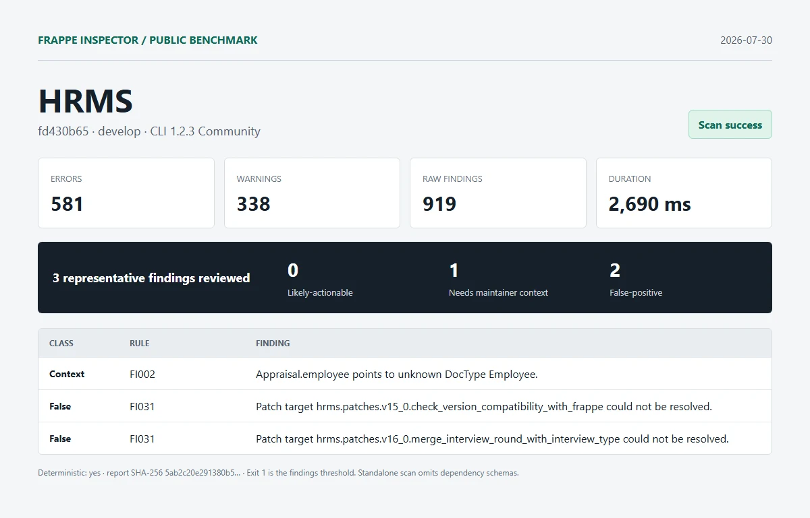

# HRMS

| Field | Value |
| --- | --- |
| Repository | [https://github.com/frappe/hrms.git](https://github.com/frappe/hrms) |
| Branch | `develop` |
| Commit | [`fd430b654630becd4ae5298089450c9b2abd3753`](https://github.com/frappe/hrms/commit/fd430b654630becd4ae5298089450c9b2abd3753) |
| Commit date | `2026-07-30T15:02:03+05:30` |
| Benchmark date | `2026-07-30` |
| CLI | `@frappe-inspector/cli` 1.2.3 Community |
| Status | Success; report generated, exit `1` indicates findings threshold |
| Run 1 | 581 errors, 338 warnings, 919 raw findings in 2,690 ms |
| Deterministic | Yes; run 1 and run 2 report SHA-256 matched |

## Manual review

1. **needs-maintainer-context - FI002**: Appraisal.employee points to unknown DocType Employee.
   - Location: `hrms/hr/doctype/appraisal/appraisal.json:58`
   - Source verification: hrms/hooks.py declares required_apps = ["frappe/erpnext"]. Employee belongs to the omitted dependency schema, so the isolated app scan cannot decide the installed-bench result.
2. **false-positive - FI031**: Patch target hrms.patches.v15_0.check_version_compatibility_with_frappe could not be resolved.
   - Location: `hrms/patches.txt:2`
   - Source verification: The module exists at hrms/patches/v15_0/check_version_compatibility_with_frappe.py.
3. **false-positive - FI031**: Patch target hrms.patches.v16_0.merge_interview_round_with_interview_type could not be resolved.
   - Location: `hrms/patches.txt:3`
   - Source verification: The module exists at hrms/patches/v16_0/merge_interview_round_with_interview_type.py.

Reviewed split: **0 likely-actionable**, **1 needs-maintainer-context**, **2 false-positive**.

## Artifacts

- [Full sanitized Markdown report](../reports/hrms/report.md)
- [SHA-256](../reports/hrms/report.sha256)
- [Exact raw scan metadata](../reports/hrms/metadata.json)
- [Methodology and limitations](../methodology.md)

This was an isolated standalone scan. Frappe and external dependency schemas were omitted. No Pro license, JSON/SARIF export, or migration diff was used. Findings are static-analysis output, not security claims.
