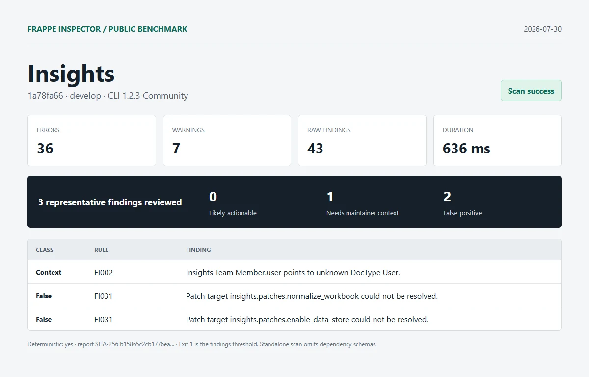

# Insights

| Field | Value |
| --- | --- |
| Repository | [https://github.com/frappe/insights.git](https://github.com/frappe/insights) |
| Branch | `develop` |
| Commit | [`1a78fa6631d158f115c507d1224cc50a3d0de36a`](https://github.com/frappe/insights/commit/1a78fa6631d158f115c507d1224cc50a3d0de36a) |
| Commit date | `2026-07-30T14:31:48+05:30` |
| Benchmark date | `2026-07-30` |
| CLI | `@frappe-inspector/cli` 1.2.3 Community |
| Status | Success; report generated, exit `1` indicates findings threshold |
| Run 1 | 36 errors, 7 warnings, 43 raw findings in 636 ms |
| Deterministic | Yes; run 1 and run 2 report SHA-256 matched |

## Manual review

1. **needs-maintainer-context - FI002**: Insights Team Member.user points to unknown DocType User.
   - Location: `insights/insights/doctype/insights_team_member/insights_team_member.json:13`
   - Source verification: User is a Frappe core DocType. This standalone app scan did not include the Frappe schema.
2. **false-positive - FI031**: Patch target insights.patches.normalize_workbook could not be resolved.
   - Location: `insights/patches.txt:3`
   - Source verification: The module exists at insights/patches/normalize_workbook.py.
3. **false-positive - FI031**: Patch target insights.patches.enable_data_store could not be resolved.
   - Location: `insights/patches.txt:8`
   - Source verification: The module exists at insights/patches/enable_data_store.py.

Reviewed split: **0 likely-actionable**, **1 needs-maintainer-context**, **2 false-positive**.

## Artifacts

- [Full sanitized Markdown report](../reports/insights/report.md)
- [SHA-256](../reports/insights/report.sha256)
- [Exact raw scan metadata](../reports/insights/metadata.json)
- [Methodology and limitations](../methodology.md)

This was an isolated standalone scan. Frappe and external dependency schemas were omitted. No Pro license, JSON/SARIF export, or migration diff was used. Findings are static-analysis output, not security claims.
