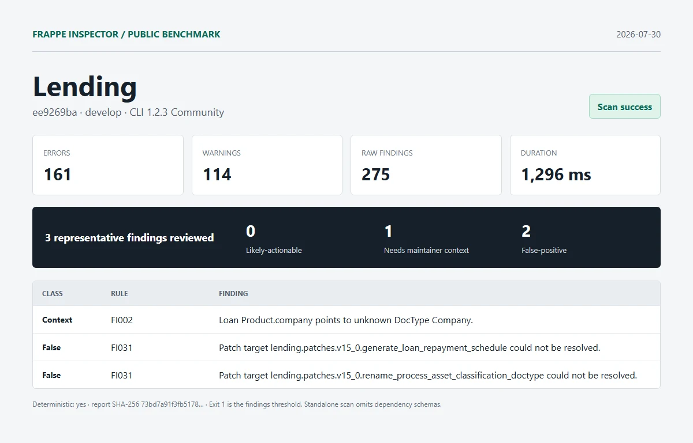

# Lending

| Field | Value |
| --- | --- |
| Repository | [https://github.com/frappe/lending.git](https://github.com/frappe/lending) |
| Branch | `develop` |
| Commit | [`ee9269ba08b72fd22295a993986d6502ce1bc399`](https://github.com/frappe/lending/commit/ee9269ba08b72fd22295a993986d6502ce1bc399) |
| Commit date | `2026-07-29T10:47:12+05:30` |
| Benchmark date | `2026-07-30` |
| CLI | `@frappe-inspector/cli` 1.2.3 Community |
| Status | Success; report generated, exit `1` indicates findings threshold |
| Run 1 | 161 errors, 114 warnings, 275 raw findings in 1,296 ms |
| Deterministic | Yes; run 1 and run 2 report SHA-256 matched |

## Manual review

1. **needs-maintainer-context - FI002**: Loan Product.company points to unknown DocType Company.
   - Location: `lending/loan_management/doctype/loan_product/loan_product.json:175`
   - Source verification: lending/hooks.py declares required_apps = ["erpnext"]. Company is supplied outside this isolated app checkout.
2. **false-positive - FI031**: Patch target lending.patches.v15_0.generate_loan_repayment_schedule could not be resolved.
   - Location: `lending/patches.txt:4`
   - Source verification: The reported module exists at lending/patches/v15_0/generate_loan_repayment_schedule.py. This is the benchmark's detailed false-positive case study.
3. **false-positive - FI031**: Patch target lending.patches.v15_0.rename_process_asset_classification_doctype could not be resolved.
   - Location: `lending/patches.txt:5`
   - Source verification: The module exists at lending/patches/v15_0/rename_process_asset_classification_doctype.py.

Reviewed split: **0 likely-actionable**, **1 needs-maintainer-context**, **2 false-positive**.

## Artifacts

- [Full sanitized Markdown report](../reports/lending/report.md)
- [SHA-256](../reports/lending/report.sha256)
- [Exact raw scan metadata](../reports/lending/metadata.json)
- [Methodology and limitations](../methodology.md)

This was an isolated standalone scan. Frappe and external dependency schemas were omitted. No Pro license, JSON/SARIF export, or migration diff was used. Findings are static-analysis output, not security claims.
