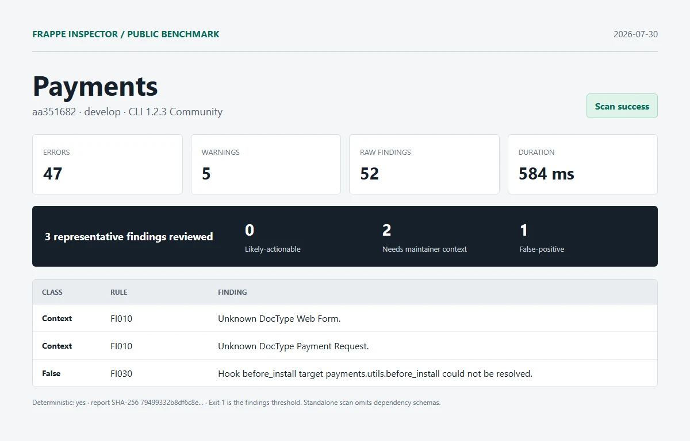

# Payments

| Field | Value |
| --- | --- |
| Repository | [https://github.com/frappe/payments.git](https://github.com/frappe/payments) |
| Branch | `develop` |
| Commit | [`aa3516827fe51d5557975b74e574e3bca9a3070d`](https://github.com/frappe/payments/commit/aa3516827fe51d5557975b74e574e3bca9a3070d) |
| Commit date | `2026-06-15T10:44:53+05:30` |
| Benchmark date | `2026-07-30` |
| CLI | `@frappe-inspector/cli` 1.2.3 Community |
| Status | Success; report generated, exit `1` indicates findings threshold |
| Run 1 | 47 errors, 5 warnings, 52 raw findings in 584 ms |
| Deterministic | Yes; run 1 and run 2 report SHA-256 matched |

## Manual review

1. **needs-maintainer-context - FI010**: Unknown DocType Web Form.
   - Location: `payments/overrides/payment_webform.py:68`
   - Source verification: Web Form is supplied by Frappe, whose schema was not included in this standalone app scan.
2. **needs-maintainer-context - FI010**: Unknown DocType Payment Request.
   - Location: `payments/payment_gateways/doctype/braintree_settings/braintree_settings.py:281`
   - Source verification: The source intentionally loads Payment Request in a gateway integration; the standalone scan omitted the external app schema that supplies that DocType.
3. **false-positive - FI030**: Hook before_install target payments.utils.before_install could not be resolved.
   - Location: `payments/hooks.py:66`
   - Source verification: payments/utils/__init__.py re-exports before_install from payments/utils/utils.py, where the function is defined.

Reviewed split: **0 likely-actionable**, **2 needs-maintainer-context**, **1 false-positive**.

## Artifacts

- [Full sanitized Markdown report](../reports/payments/report.md)
- [SHA-256](../reports/payments/report.sha256)
- [Exact raw scan metadata](../reports/payments/metadata.json)
- [Methodology and limitations](../methodology.md)

This was an isolated standalone scan. Frappe and external dependency schemas were omitted. No Pro license, JSON/SARIF export, or migration diff was used. Findings are static-analysis output, not security claims.
